## 开始
### 项目简介
> 由于Markdown语法的便捷性, 我们从繁重的排版布局工作中解脱出来, 越来越多的人开始接受这种写作方式, 该插件可以将你的md笔记, 方便的同步到博客园中, 即使你是使用的本地图片, 也无须担心, 他都能轻松应对, 并且不会对你的本地文档造成任何影响

### 快速上手
> 既然是Obsidian插件, 必然默认以及安装好了Obsidian这款编辑器

#### 下载依赖插件
>关闭安全模式，如果已经关闭可跳过此步骤
>路径:  `设置` -> `选项` -> `第三方插件` 

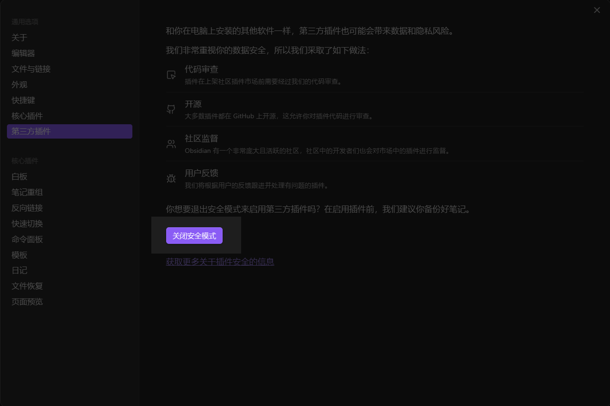

> 打开社区插件市场，这可能需要你会一点点的魔法
> 路径:  `设置` -> `选项` -> `第三方插件` 

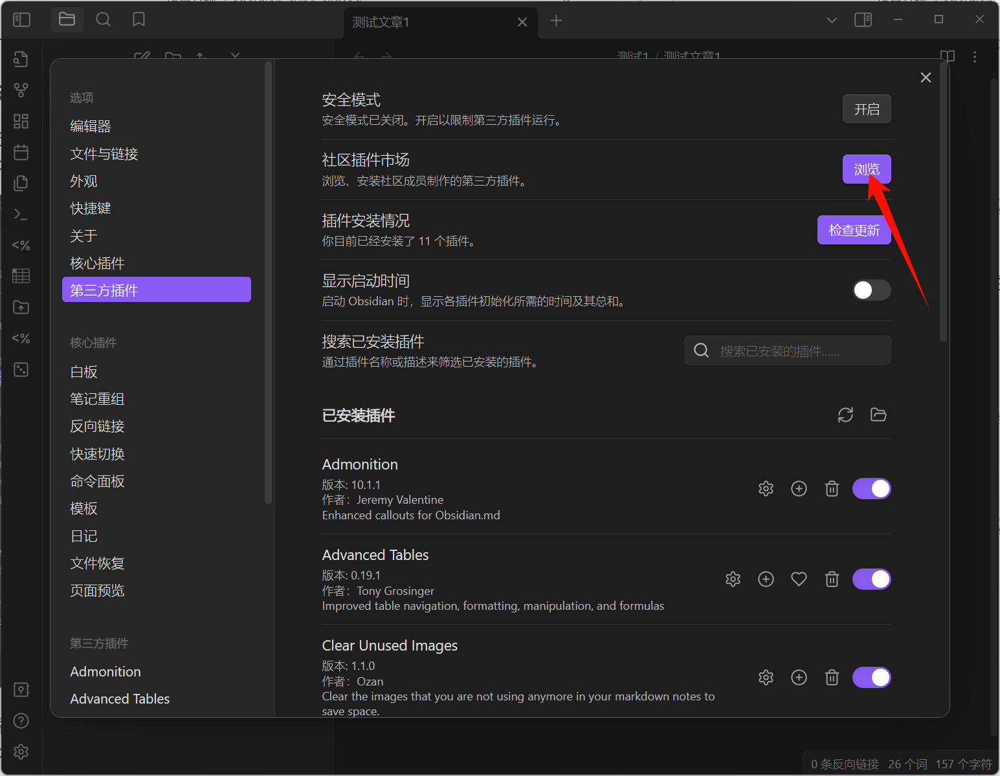

> 社区插件市场内搜索 `Custom Attachment Location`

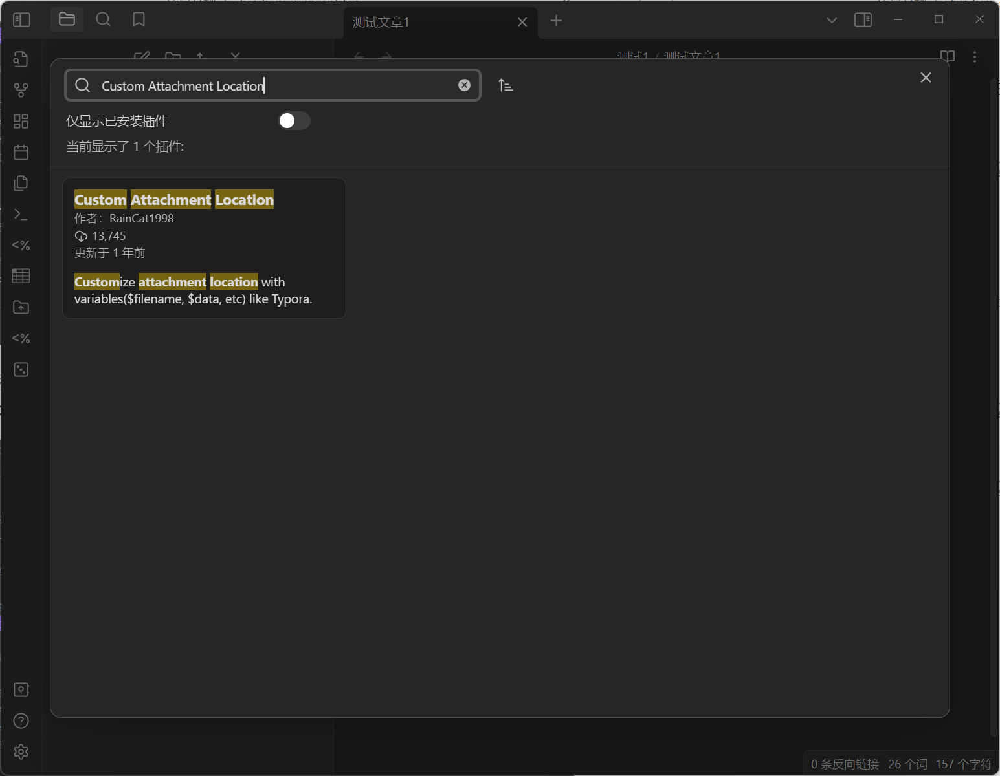

> 点击搜索出的插件，点击安装

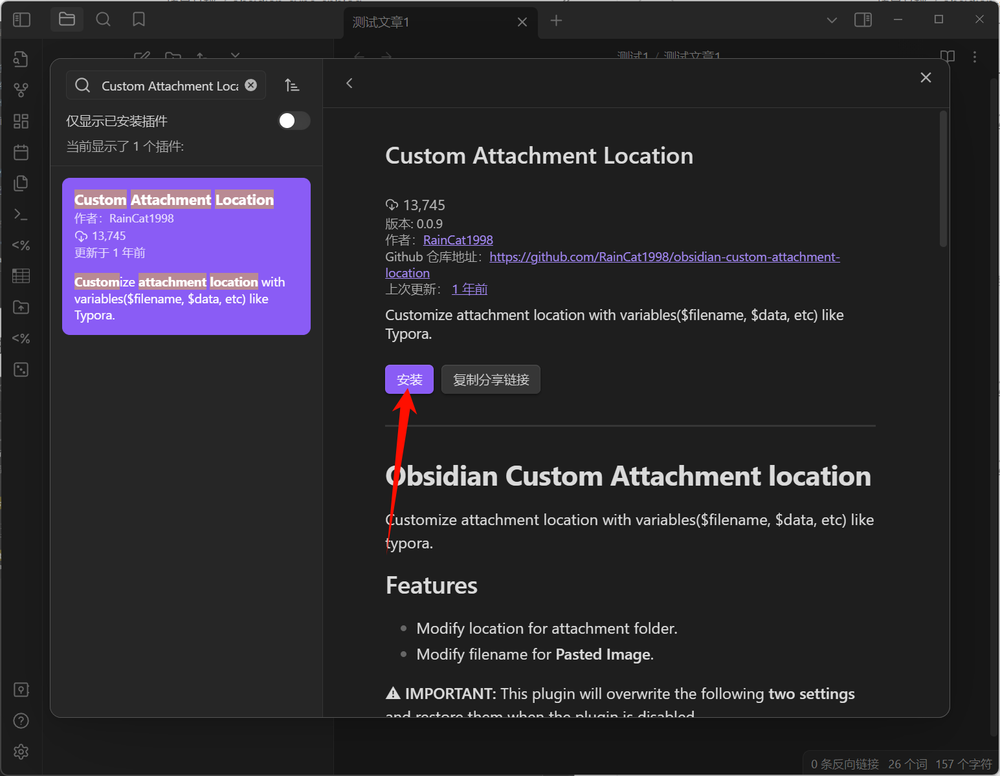

> 点击启用该插件

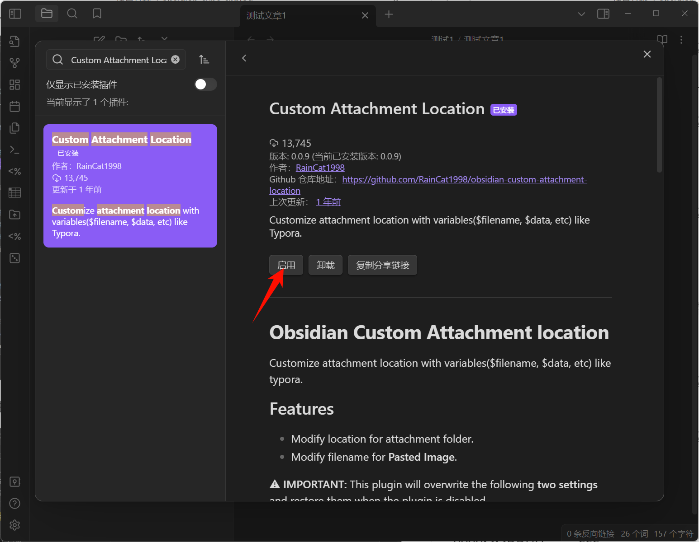

> 下载obsidian-sync-cnblog

操作步骤如上

#### 配置Obsidian

> 我们需要进入到 `设置` -> `选项` -> `文件与链接` 选项卡，将下图中红框内的设置项调整成与图片一致

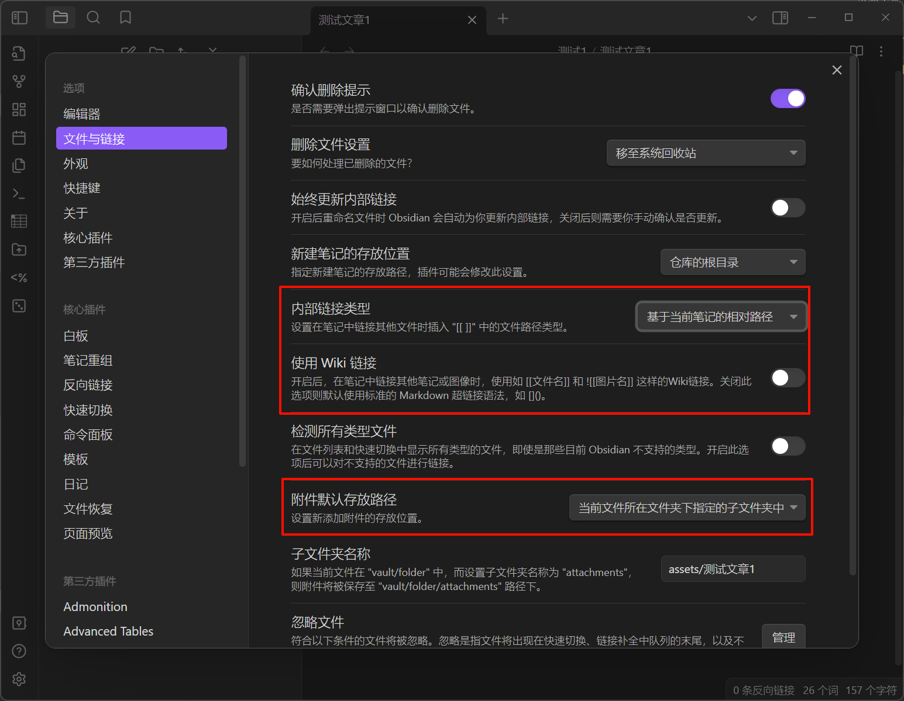

> 进入 `Custom Attachment Location` 选项卡，按照下图配置项依次配置即可
> 路径: `设置` -> `第三方插件` -> `Custom Attachment Location`

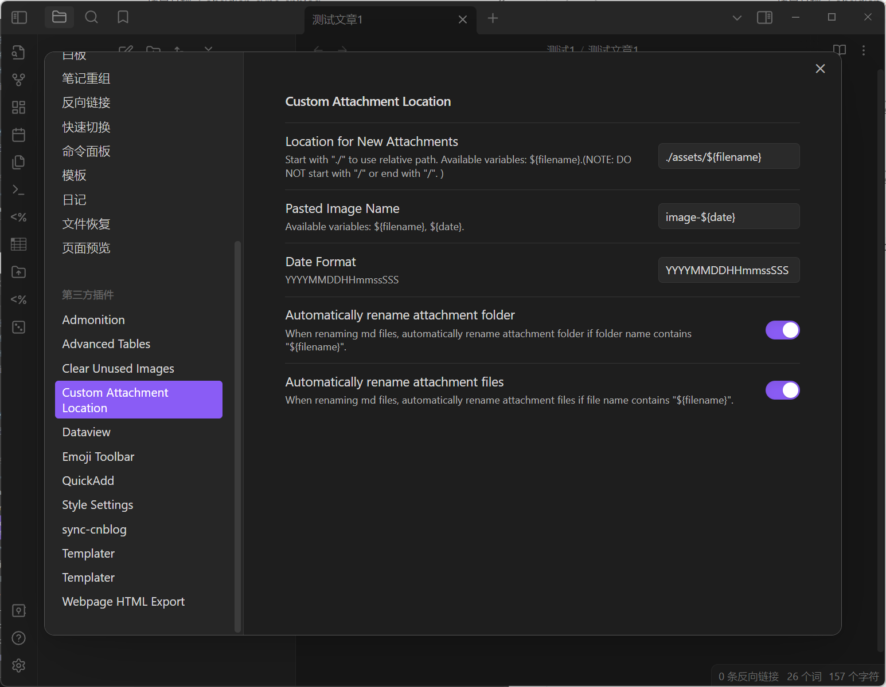

> 进入 `obsidian-sync-cnblog`选项卡，该选项卡中的除去 `location_posts`以外的所有参数均要参考自己的博客园账号，按照实际需求配置

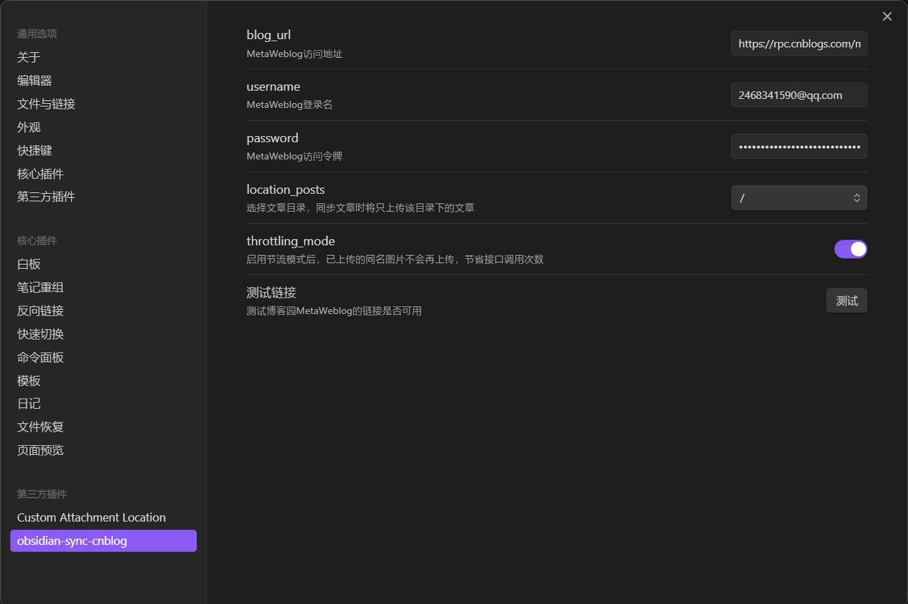

> 访问如下链接 [博客后台 - 博客园 (cnblogs.com)](https://i.cnblogs.com/settings)，未登录用户会跳转登录页面,
> 输入自己的账号密码登录即可,登录成功后。会跳转博客园后台, 滑到页面底部即可看到如下页面

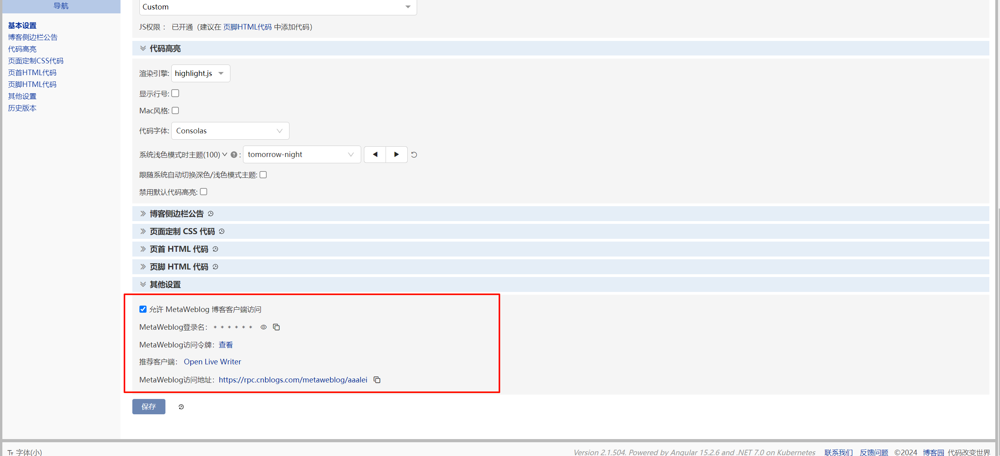

- 勾选允许 MetaWeblog 博客客户端访问
-  参考上图配置如下参数  `blog_url`，`username`，`password`
- `location_posts` 文章的同步目录，默认为仓库的根目录

#### 验证插件是否可用

> 点击设置里的测试连接按钮，可以验证当前插件是否可用

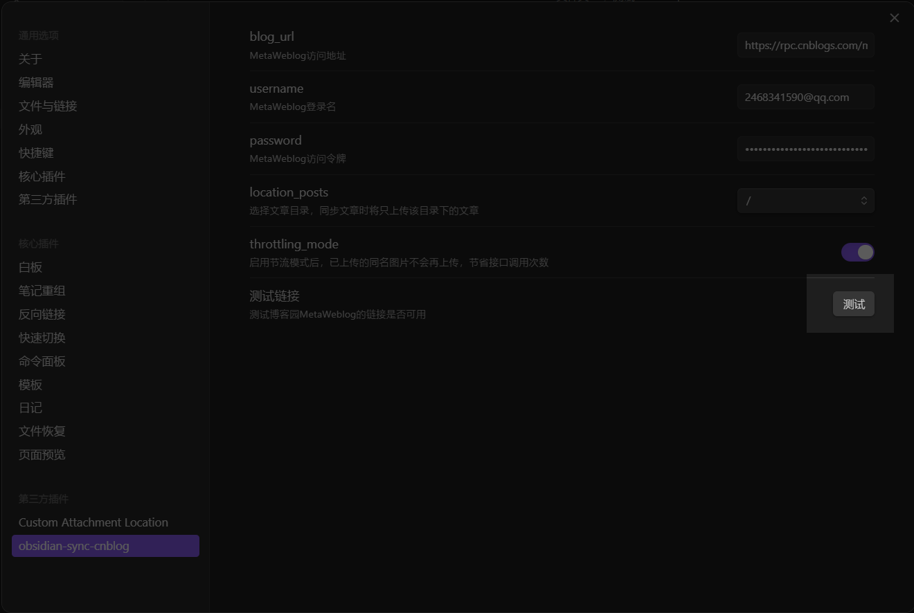

#### 上传文章
> 启用插件后, 右键.md结尾的文件会出现 `同步到博客园` 的按钮, 点击该按钮, 文章会自动发布到博客园

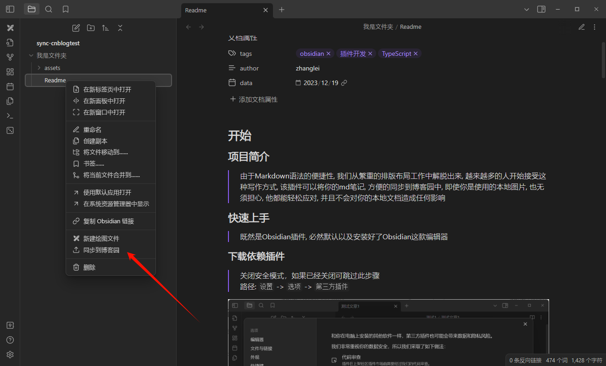

#### 修改文章
> 如果已经上传的文章, 再次点击 `同步到博客园` 的按钮, 会对博客园已发布文章进行更新

#### 重命名
> 当前插件会自动检查重命名操作, 如果该文章已经上传博客园, 并且进行了重命名, 博客园文章的名称也会自动进行重命名的操作
